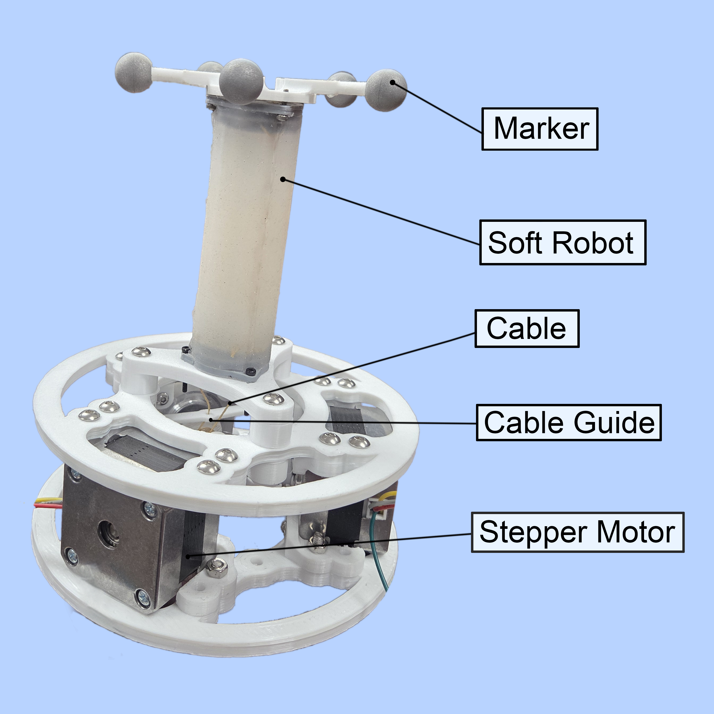
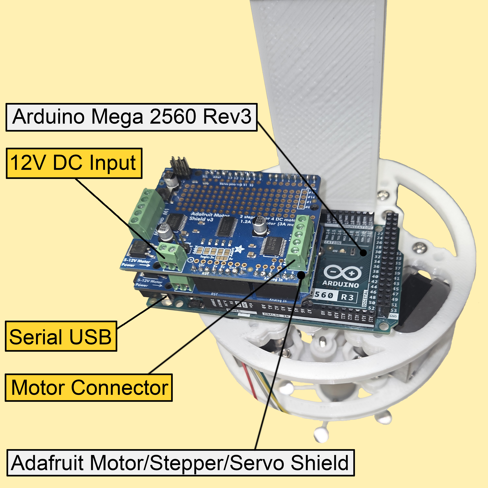
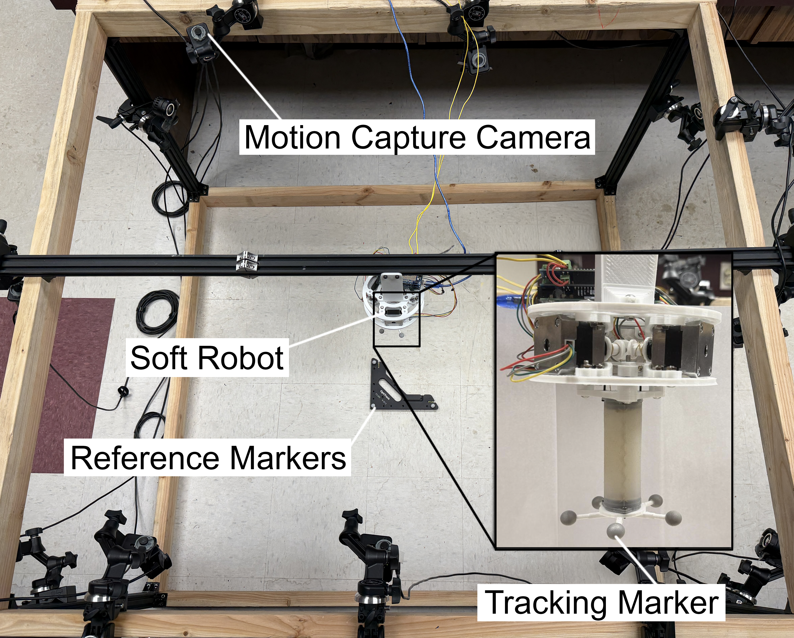
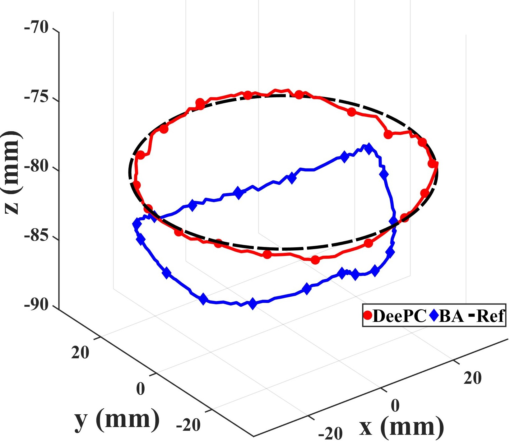
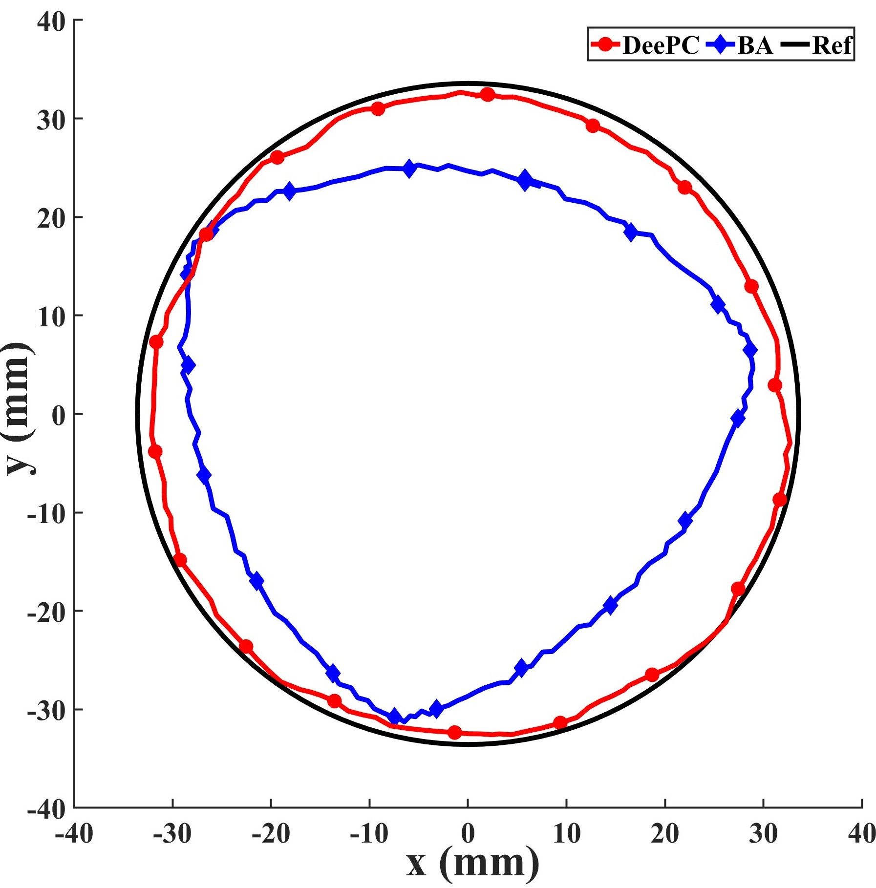

# Direct-Data-Driven-Predictive-Control-for-a-Three-dimensional-Cable-Driven-Soft-Robotic-Arm

## Overview
We design and fabricate a soft robotic arm with a thick tubing backbone for stability, a dense silicone body with large cavities for strength and flexibility, and rigid endcaps for secure termination. Using this platform, we implement DeePC with singular value decomposition (SVD)-based dimension reduction for two key control tasks: fixed-point regulation and trajectory tracking in 3D space. 

## Hardware Design
<p align="center">
  
  
  
</p>

## Result
<p align="center">
  
  
</p>

## Cite
Please consider cite our paper if you find this repo is useful.
```bibtex
@article{ouyang2025direct,
  title={Direct Data-Driven Predictive Control for a Three-dimensional Cable-Driven Soft Robotic Arm},
  author={Ouyang, Cheng and Islam, Moeen Ul and Chen, Dong and Zhang, Kaixiang and Li, Zhaojian and Tan, Xiaobo},
  journal={arXiv preprint arXiv:2510.08953},
  year={2025}
}
